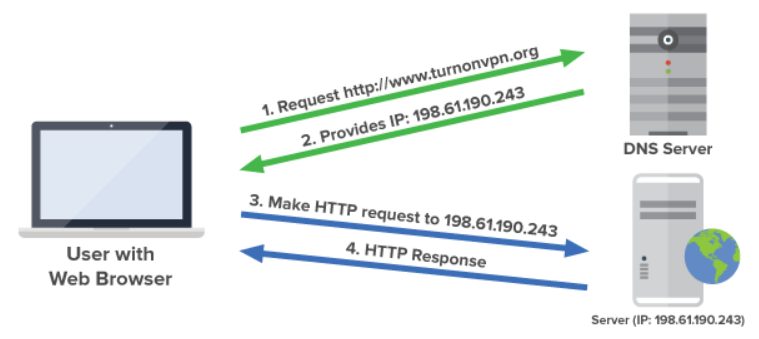

# DNS (Domain Name System)

[DNS - Domain Name Service](https://gcore.com/learning/dns-servers-what-they-are-and-how-they-work)


DNS er internettets "telefonkatalog". Når du skriver inn en nettadresse som `www.vg.no`, oversetter DNS denne til en **IP-adresse** (f.eks. `195.88.54.16`) som datamaskiner kan forstå.


---

## Hvordan fungerer DNS?
1. Brukeren skriver inn en URL i nettleseren (f.eks. `www.turnonvpn.org`).  
2. Nettleseren spør en DNS-server: "Hva er IP-adressen til denne adressen?"  
3. DNS-serveren svarer med en IP-adresse.  
4. Nettleseren kan nå sende en HTTP-forespørsel direkte til denne IP-adressen.  

Dette gjør at vi mennesker kan bruke enkle navn (domener) i stedet for å huske lange tallrekker (IP-adresser).

---
<div style="page-break-after: always;"></div>

## Eksempel med `nslookup`
Kommandoen `nslookup` lar oss slå opp IP-adressen til et domenenavn.  

### Eksempel:  
```bash
nslookup www.vg.no
```

**Resultat:**  
```
Server:  my.meraki.net
Address:  10.112.10.1

Non-authoritative answer:
Name:    www.vg.no
Addresses:  2001:67c:21e0::16
          195.88.55.16
          195.88.54.16
```

Her ser vi at `www.vg.no` har både en **IPv6-adresse** (`2001:67c:21e0::16`) og to **IPv4-adresser** (`195.88.55.16` og `195.88.54.16`).  

---
<div style="page-break-after: always;"></div>

## Eksempel med `curl`
`curl` brukes for å hente innhold direkte fra en URL eller IP-adresse.

### Eksempel:  
```bash
curl -L http://195.88.55.16 --output test.html
```

- `-L` betyr at `curl` følger eventuelle videresendinger (redirects).  
- `--output test.html` lagrer svaret fra serveren i en fil kalt `test.html`.  

👉 Dette kan brukes til å teste at serveren svarer, eller for å hente nettsider direkte.  

---

## Eksempel med `tracert` / `traceroute`
For å se hvilken vei (hvilke rutere/hopp) pakken tar gjennom nettet, kan vi bruke:  

- På **Windows**: `tracert`
- På **Mac/Linux**: `traceroute`

### Eksempel (Windows):  
```bash
tracert www.vg.no
```

**Resultat:**  
```
Tracing route to www.vg.no [195.88.54.16]
over a maximum of 30 hops:

  1     2 ms     2 ms     2 ms  my.meraki.net [10.112.10.1]
  2     5 ms     3 ms     3 ms  static136.cust.as2116.net [213.52.5.136]
  3     3 ms     3 ms     3 ms  te5-0-4.ar1.maake2a.as2116.net [195.0.244.9]
  4     8 ms    10 ms     7 ms  ae18.cr3.fn3.as2116.net [195.0.245.199]
  5     *        6 ms     6 ms  ae21.cr1.fn3.as2116.net [193.75.1.68]
  6     7 ms    19 ms    17 ms  ae8.ar2.ulv89.as2116.net [195.0.241.55]
  7     6 ms     6 ms     6 ms  www.vg.no [195.88.54.16]

Trace complete.
```

👉 Hvert "hopp" viser en ruter som pakken passerer på veien til destinasjonen.

---
<div style="page-break-after: always;"></div>

## Verktøyoversikt

| Verktøy       | Beskrivelse                                   | Windows kommando  | Mac/Linux kommando |
|---------------|-----------------------------------------------|-------------------|---------------------|
| **nslookup**  | Slår opp IP-adressen til et domenenavn        | `nslookup www.vg.no` | `nslookup www.vg.no` |
| **curl**      | Henter innhold fra en URL/IP direkte          | `curl -L http://www.vg.no` | `curl -L http://www.vg.no` |
| **tracert**   | Viser ruten pakken tar til destinasjonen      | `tracert www.vg.no` | `traceroute www.vg.no` |

---

## Kort oppsummert
- **DNS** oversetter domenenavn til IP-adresser.  
- **nslookup** lar deg slå opp IP-adressen til et domene.  
- **curl** kan hente innhold direkte fra en adresse.  
- **tracert/traceroute** viser veien pakkene tar gjennom nettet.  
