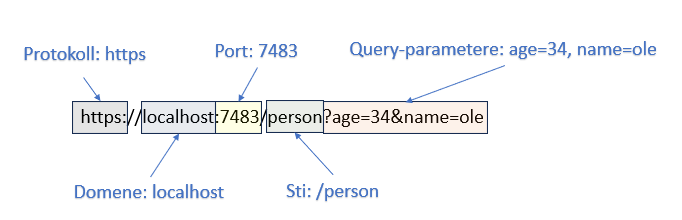

# HTTP – Detaljert forklaring



HTTP (HyperText Transfer Protocol) er en protokoll som definerer regler og konvensjoner for hvordan data skal struktureres og overføres mellom klient og server.


---
## Protokoll og Klient-Server Modell

- **Protokoll**: HTTP definerer hvordan klient (f.eks. nettleser) og server kommuniserer.  
- **Klient-Server modell**: Klienten sender forespørsler → serveren svarer med respons.

---
## HTTP Metoder

- **GET**: Henter data fra serveren (nettsider, bilder, osv.).  
- **POST**: Sender data til serveren (skjemadata, filopplasting).  
- **PUT**: Oppdaterer eksisterende data på serveren.  
- **DELETE**: Sletter data fra serveren.

---
## Statuskoder

- **200 OK** – Forespørsel var vellykket.  
- **201 Created** – Ressurs ble opprettet.  
- **301 Moved Permanently** – Ressursen er flyttet.  
- **400 Bad Request** – Ugyldig forespørsel.  
- **401 Unauthorized** – Autentisering kreves.  
- **403 Forbidden** – Tilgang nektet.  
- **404 Not Found** – Ressursen finnes ikke.  
- **500 Internal Server Error** – Serverfeil.  

---
<div style="page-break-after: always;"></div>

## URL-struktur

Eksempel:  
```
https://localhost:7483/person?age=34&name=ole
```

- **Protokoll**: https  
- **Domene**: localhost  
- **Port**: 7483  
- **Sti**: /person  
- **Query-parametere**: age=34, name=ole  

---
## Request og Response

En HTTP-forespørsel (request) sendes fra klient → server.  
Server svarer med en HTTP-respons (response).  

Begge inneholder:  
- Protokollversjon  
- Metode / Statuskode  
- Headere  
- Body (valgfritt)

---
## Viktige HTTP Headere

| Header          | Beskrivelse |
|-----------------|-------------|
| Accept          | Angir hvilke mediatyper klienten kan håndtere. |
| Authorization   | Autentiseringsinfo (brukernavn, passord, token). |
| Cache-Control   | Kontroll av caching. |
| Content-Type    | Angir type innhold (f.eks. application/json). |
| Content-Length  | Lengde på innhold i bytes. |
| Cookie          | Sender brukerens sesjonsdata. |
| User-Agent      | Identifiserer klienten (nettleser, app). |
| Location        | Brukes ved redirect (3xx svar). |
| Origin          | Domenet forespørselen kom fra (CORS). |
| Referer         | Angir hvilken side som utløste forespørselen. |
| Server          | Info om programvaren på serveren. |
| Set-Cookie      | Sender cookie til klienten. |
| ETag            | Identifikator for ressursens versjon. |
| Last-Modified   | Når ressursen sist ble endret. |
| Content-Encoding| Komprimeringsmetode (gzip, deflate, osv.). |

---
## HTTP-Body (Request/Response data)

Eksempler på hva som kan ligge i body:

1. **Tekstlige data** – HTML, JSON, XML.  
2. **Bilder / video / lyd** – Multimediafiler.  
3. **Filer** – PDF, dokumenter, opplastede filer.  
4. **Skjemadata** – Brukerinput fra nettskjemaer.  
5. **API-data** – JSON/XML-format for kommunikasjon mellom tjenester.  
6. **Multipart** – Flere filer/data samtidig (f.eks. bilde + tekst).  

---
## HttpContext i ASP.NET / ASP.NET Core

`HttpContext` representerer all HTTP-informasjon i en forespørsel.

### Viktige egenskaper:
- **Request** – data om forespørselen (metode, headers, URL).  
- **Response** – data som sendes tilbake (status, headers, body).  
- **Session** – lagring av brukerspesifikke data.  
- **User** – autentisert bruker (identity, claims).  

### Eksempel i C#:
```csharp
app.MapGet("/example", (HttpContext context) =>
{
    string host = context.Request.Host.Value;
    string userAgent = context.Request.Headers["User-Agent"];

    context.Response.StatusCode = 200;
    context.Response.Headers["Content-Type"] = "text/plain";

    return $"Host: {host}, User-Agent: {userAgent}";
});
```

---
<div style="page-break-after: always;"></div>

## URL-Encoding (Spesialtegn)

| Spesialtegn | URL-Encoding | Beskrivelse |
|-------------|--------------|-------------|
| < | %3C | Mindre enn |
| > | %3E | Større enn |
| + | %2B | Pluss |
| - | %2D | Minus |
| * | %2A | Multiplikasjon |
| / | %2F | Divisjon |
| = | %3D | Likhet |
| & | %26 | OG (ampersand) |
| ! | %21 | IKKE (utropstegn) |
| % | %25 | Modulus |
| @ | %40 | At-tegn |
| # | %23 | Hashtag |
| ? | %3F | Spørsmålstegn |
| : | %3A | Kolon |
| ; | %3B | Semikolon |
| , | %2C | Komma |
| Mellomrom | %20 | Mellomrom |
| [ | %5B | Venstre firkantparentes |
| ] | %5D | Høyre firkantparentes |
| ( | %28 | Venstre parentes |
| ) | %29 | Høyre parentes |

---

📌 Dette dokumentet gir både **grunnleggende og avansert oversikt** over HTTP for studenter.
