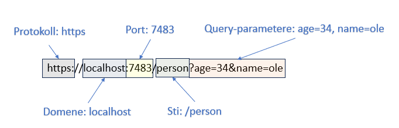

# HTTP (Hypertext Transfer Protocol)

**HTTP (Hypertext Transfer Protocol)** er en applikasjonslagsprotokoll som brukes til å overføre hypermediadokumenter, som HTML.  
Den ble designet for kommunikasjon mellom nettlesere (klienter) og webservere, men kan også brukes til andre formål.  

HTTP følger en klassisk **klient–server-modell**, der klienten åpner en forbindelse og sender en forespørsel (**request**), og serveren svarer med et svar (**response**).  
HTTP er en **stateless protokoll**, noe som betyr at serveren ikke husker tidligere forespørsler mellom klient og server.  

---

## Oversikt over HTTP/1.1 og HTTP/2
- **HTTP/1.1** åpner en ny tilkobling for hver forespørsel/response-par. Dette kan føre til tregere ytelse.  
- **HTTP/2** introduserte **multiplexing**, der flere forespørsler kan sendes parallelt over samme tilkobling, som gir bedre ytelse.  

---

## Egenskaper ved HTTP

### HTTP er enkelt
- Menneskelesbart og lett å forstå.  
- Forespørsler og svar kan leses direkte, noe som gjør feilsøking enklere.  

### HTTP er utvidbart
- Gjennom **HTTP headers** kan nye funksjoner enkelt legges til.  
- Gir fleksibilitet for både klient og server til å avtale nye funksjoner.  

### HTTP er stateless, men ikke sessionless
- **Stateless**: Hver forespørsel behandles uavhengig. Ingen automatisk kobling til tidligere forespørsler.  
- **Sessions** kan likevel opprettes ved hjelp av **cookies**, som gir mulighet for å huske brukeren (f.eks. handlekurv i nettbutikk).  

### HTTP og forbindelser
- HTTP baserer seg vanligvis på **TCP** (pålitelig transport).  
- Før en forespørsel/svar kan utveksles, må det etableres en TCP-forbindelse.  
- HTTP/1.1 introduserte **pipelining** og **persistent connections** (Connection: keep-alive).  
- HTTP/2 gikk videre og introduserte multiplexing for bedre effektivitet.  
- Nyere forsøk: **QUIC**, bygget på UDP, for enda raskere og mer pålitelig kommunikasjon.  

---
<div style="page-break-after: always;"></div>

## HTTP Request Methods (HTTP Verbs)
HTTP definerer en rekke metoder som beskriver handlingen som skal utføres.  

- **GET**: Henter data fra serveren (ingen endring på server).  
- **POST**: Sender data til serveren (kan skape nye ressurser eller endre tilstand).  
- **PUT**: Erstatter en ressurs helt.  
- **DELETE**: Sletter en ressurs.  
- **PATCH**: Delvis oppdatering av en ressurs.  
- **HEAD**: Som GET, men uten innholdet i svaret (brukes ofte til å sjekke metadata).  
- **OPTIONS**: Viser hvilke metoder som er tilgjengelige for en ressurs.  
- **CONNECT**: Oppretter en tunnel til serveren (ofte brukt for HTTPS).  
- **TRACE**: Test for å se hvordan en forespørsel passerer gjennom servere/proxyer.  

---

## HTTP Headers

HTTP-headere gir ekstra informasjon om forespørselen eller svaret.  

### Eksempel på Request Headers:
```
GET /home.html HTTP/1.1
Host: developer.mozilla.org
User-Agent: Mozilla/5.0
Accept: text/html,application/xhtml+xml
Accept-Language: en-US,en;q=0.5
Connection: keep-alive
```

### Eksempel på Response Headers:
```
200 OK
Content-Type: text/html; charset=utf-8
Date: Mon, 18 Jul 2016 16:06:00 GMT
Server: Apache
Set-Cookie: mykey=myvalue; expires=Mon, 17-Jul-2017
```

---

## HTTP Status Codes

HTTP-svar har alltid en **statuskode** som indikerer resultatet:  

- **1xx Informational** – Informasjonsmeldinger (f.eks. 100 Continue).  
- **2xx Success** – Forespørselen var vellykket (f.eks. 200 OK, 201 Created).  
- **3xx Redirection** – Krever videre handling (f.eks. 301 Moved Permanently, 302 Found).  
- **4xx Client Error** – Feil fra klientens side (f.eks. 400 Bad Request, 401 Unauthorized, 404 Not Found).  
- **5xx Server Error** – Feil på serversiden (f.eks. 500 Internal Server Error, 503 Service Unavailable).  

---

## Hva er en Webserver?

En webserver består av både **hardware** og **software**:

- **Hardware**: Datamaskinen som lagrer webinnhold (HTML, CSS, JavaScript) og kjører serverprogramvaren.  
- **Software**: Programvaren som håndterer forespørsler og sender svar tilbake til klienten.  
  - Forstår **URLs** og **HTTP-protokollen**.  
  - Leverer webinnhold til brukere via internett.  

### Start din egen enkle webserver
- **Python**: `python -m http.server 2345`  
- **Java**: `jwebserver -p 4567`  
- **Node.js**: `http-server -p 6666`  
- **PHP**: `php -S 127.0.0.1:4321`  

### Eksempler på webservere
- IIS (Microsoft)  
- Nginx  
- Apache Tomcat  
- Eclipse Glassfish  
- Apache HTTP Server  

---

## URL og URI



- **URL (Uniform Resource Locator)**: Selve adressen til en ressurs på nettet (f.eks. `https://www.vg.no`).  
- **URI (Uniform Resource Identifier)**: Et bredere begrep som identifiserer en ressurs, men trenger ikke å angi hvordan den hentes.  

**Forskjell:**  
- Alle URL-er er URI-er, men ikke alle URI-er er URL-er.  

Eksempel:  
- URL: `https://www.geeksforgeeks.org/`  
- URI: `urn:isbn:0-294-56559-3`  

---

## Nyttige verktøy for å utforske HTTP
- **Chrome DevTools** (Ctrl + Shift + I) → Se forespørsler, svar og headere.  
- **Postman** → Teste API-er og sende forespørsler.  
- **Wireshark** → Nettverksanalyse for å se HTTP-trafikk.  

---

## Kort oppsummert
- HTTP er en enkel, men kraftig protokoll for kommunikasjon på nettet.  
- Den er **stateless**, men med cookies kan vi ha **sessions**.  
- HTTP har mange metoder (GET, POST, PUT, DELETE osv.) for å definere handlinger.  
- Statuskoder (2xx, 3xx, 4xx, 5xx) hjelper å forstå hva som skjer.  
- Webservere leverer innhold, og URL/URI identifiserer ressurser på nettet.  
