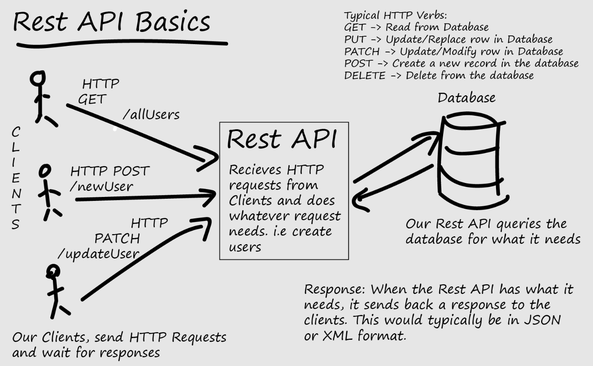

# Innføring i RESTful API

## Hva er et RESTful API?

- **REST** står for **REpresentational State Transfer**
- **State** = data  
- **Representational** = formatene dataene presenteres i (JSON, XML, HTML osv.)  
- **Transfer** = utvekslingen av data mellom klient (f.eks. nettleser, mobilapp, Postman) og server via HTTP  

Et **REST API** er et bindeledd (Application Programming Interface) som gjør at to applikasjoner kan snakke sammen over HTTP, på samme måte som nettlesere kommuniserer med webservere.

---

## REST vs SOAP

Det finnes to hovedtyper webtjenester:
- **SOAP** (Simple Object Access Protocol) – strengere, krever mer båndbredde, kun XML
- **REST** – enklere, fleksibel, støtter JSON, XML, tekst, HTML osv.  

REST er i dag mest brukt fordi det er **lettvekts, skalerbart og vedlikeholdbart**.

---

## Kjennetegn ved REST-arkitektur

1. **Klient–server**  
   Klient (f.eks. app) og server utvikles uavhengig.
2. **Stateless**  
   Hver forespørsel inneholder all nødvendig informasjon. Serveren lagrer ikke tilstand om klienten.
3. **Cachebar**  
   Svar kan merkes som cachebare for å redusere unødvendige forespørsler.
4. **Lagdeling**  
   Arkitekturen kan bygges opp i lag, f.eks. klient → API-gateway → server → database.
5. **Uniform interface**  
   Bruk av standardiserte metoder og URL-struktur.
6. **Kode på forespørsel (valgfritt)**  
   Serveren kan sende kode (skript, applets) som klienten kjører.

---

## Ressurser i REST

- Alt som kan navngis kan være en ressurs (bruker, melding, bilde, produkt osv.)
- Ressurser identifiseres med **URI-er** (Uniform Resource Identifiers)

**Eksempler:**
- `/employees` – liste av ansatte  
- `/employees/1234` – en spesifikk ansatt  
- `/messages/{id}/comments/{id}` – kommentarer til en melding  

Bruk **substantiv**, ikke verb i URI-er.  
✅ Riktig: `/employees/1234`  
❌ Feil: `/getEmployee/1234`

---

## HTTP-metoder i REST

- **GET** → Hent ressurser  
- **POST** → Opprett ressurser  
- **PUT/PATCH** → Oppdater ressurser  
- **DELETE** → Slett ressurser  

👉 Viktig: bruk riktig metode til riktig oppgave.

---

## Eksempler på spørringer

- **GET** `/employees` → hent alle ansatte  
- **POST** `/employees` → legg til en ny ansatt  
- **PUT** `/employees/1234` → oppdater ansatt 1234  
- **DELETE** `/employees/1234` → slett ansatt 1234  

---

## Query Parameters

For filtrering, sortering og paginering kan man bruke query-parametere:
- `/employees?dept=HR` – filtrering  
- `/employees?sort=dsc` – sortering  
- `/employees?page=5&limit=10` – paginering  

---

## Idempotens

En metode er **idempotent** hvis samme kall kan gjentas uten å endre resultatet:
- **Idempotente metoder**: GET, PUT, DELETE  
- **Ikke idempotent**: POST  

---

## HATEOAS (Hypermedia As The Engine Of Application State)

En REST-klient trenger kun start-URL-en. Derfra kan den følge **hyperlenker** i svarene for å navigere videre i API-et.

---

## HTTP-feilkoder

- **200 OK** – vellykket forespørsel  
- **201 Created** – ny ressurs opprettet  
- **204 No Content** – ressurs slettet  
- **400 Bad Request** – ugyldig forespørsel  
- **401 Unauthorized** – mangler gyldig innlogging  
- **403 Forbidden** – tilgang nektet  
- **404 Not Found** – ressurs finnes ikke  
- **500 Internal Server Error** – serverfeil  

---

## Versjonering

Når API-et utvikles, er det vanlig å legge inn versjonsnummer i URL-en:  
- `/v1/employees`  
- `/v2/employees`

---

## Oppsummering

- RESTful API gjør det enkelt å bygge løsninger som kan brukes av både web og mobil.  
- Bruk **ressurser (substantiv)**, **standard HTTP-metoder**, og følg **best practices** for struktur.  
- REST er fleksibelt, lettvekts og det mest brukte API-designet i dag.

---

## Ressurser for videre læring

- [https://restfulapi.net/](https://restfulapi.net/)  
- [https://www.restapitutorial.com/](https://www.restapitutorial.com/)  
- [https://restcookbook.com/](https://restcookbook.com/)  
- [https://www.javaguides.net/p/rest-api-tutorial.html](https://www.javaguides.net/p/rest-api-tutorial.html)  
- [https://www.javaguides.net/p/restful-tutorial.html](https://www.javaguides.net/p/restful-tutorial.html)  
