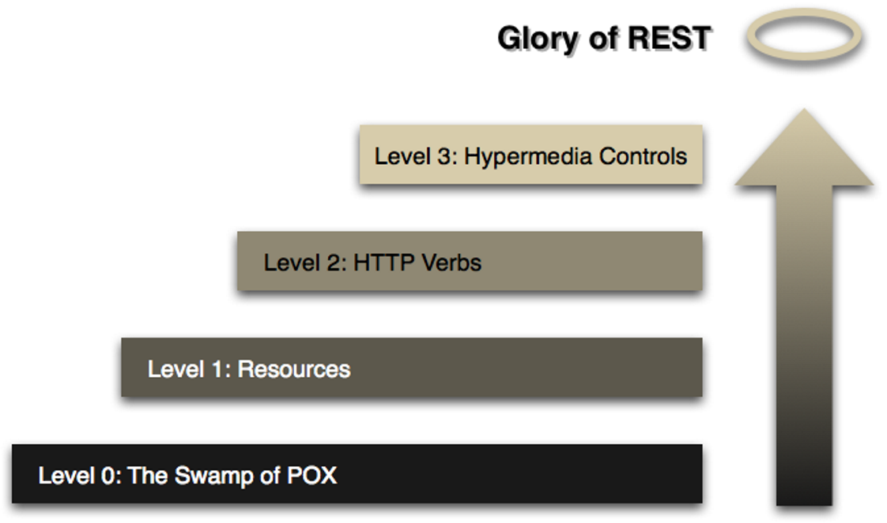

# Richardson Maturity Model (RMM)  
*Skritt mot "The Glory of REST"*  

[Maturity Model - Richardson](https://martinfowler.com/articles/richardsonMaturityModel.html)

Richardson Maturity Model (RMM) er en modell utviklet av **Leonard Richardson** som deler opp REST-tilnærmingen i **fire nivåer (0–3)**. Hvert nivå introduserer nye prinsipper som gjør en API mer RESTful.  

Målet er å bevege seg fra enkle fjernkall til full bruk av HTTP og hypermedia, på en måte som skalerer og er lett å bruke.  

---

## 🌍 Oversikt
- **Level 0 – Enkle fjernkall (RPC-stil)**  
- **Level 1 – Ressurser**  
- **Level 2 – HTTP-verb og statuskoder**  
- **Level 3 – Hypermedia Controls (HATEOAS)**  

---



<div style="page-break-after: always;"></div>

## 🔹 Level 0 – Fjernkall med HTTP som transport
På dette nivået brukes HTTP kun som en **transportkanal** for å sende meldinger, typisk i XML eller JSON.  
Man har gjerne **ett eneste endepunkt** (f.eks. `/appointmentService`) som alle forespørsler går til.  

Eksempel: bestilling av legetime
```http
POST /appointmentService HTTP/1.1
<openSlotRequest date="2010-01-04" doctor="mjones"/>
```

Svar:
```http
HTTP/1.1 200 OK
<openSlotList>
   <slot start="1400" end="1450" doctor="mjones"/>
   <slot start="1600" end="1650" doctor="mjones"/>
</openSlotList>
```

👉 Ulempen er at alt går via ett endepunkt, som gjør det uoversiktlig og lite fleksibelt.  

---
<div style="page-break-after: always;"></div>

## 🔹 Level 1 – Ressurser
Her introduseres **ressurser med egne URI-er**. I stedet for å sende alt til `/appointmentService`, kan man bruke egne ressurser for leger, slots og pasienter.  

Eksempel:
```http
GET /doctors/mjones/slots?date=2010-01-04
```

Svar:
```http
HTTP/1.1 200 OK
<openSlotList>
   <slot id="1234" doctor="mjones" start="1400" end="1450"/>
   <slot id="5678" doctor="mjones" start="1600" end="1650"/>
</openSlotList>
```

Bestilling av time:
```http
POST /slots/1234
<appointmentRequest>
   <patient id="jsmith"/>
</appointmentRequest>
```

👉 Fordel: bedre struktur, ressurser kan håndteres separat.  

---
<div style="page-break-after: always;"></div>

## 🔹 Level 2 – HTTP-verb og statuskoder
På dette nivået brukes **HTTP-verbene riktig**:  
- `GET` for å hente data  
- `POST` for å opprette nye ressurser  
- `PUT` for å oppdatere eksisterende ressurser  
- `DELETE` for å fjerne ressurser  

Man benytter også **HTTP-statuskoder** som 200 (OK), 201 (Created), 404 (Not Found), 409 (Conflict).  

Eksempel – hente ledige timer:
```http
GET /doctors/mjones/slots?date=20100104&status=open
```

Svar:
```http
HTTP/1.1 200 OK
<openSlotList>
   <slot id="1234" doctor="mjones" start="1400" end="1450"/>
</openSlotList>
```

Bestilling:
```http
POST /slots/1234
<appointmentRequest>
   <patient id="jsmith"/>
</appointmentRequest>
```

Svar når bestillingen er opprettet:
```http
HTTP/1.1 201 Created
Location: /slots/1234/appointment
<appointment>
   <slot id="1234" doctor="mjones" start="1400" end="1450"/>
   <patient id="jsmith"/>
</appointment>
```

👉 Fordel: følger HTTP-standard, caching og feilhåndtering blir enklere.  

---
<div style="page-break-after: always;"></div>

## 🔹 Level 3 – Hypermedia Controls (HATEOAS)
På dette nivået brukes **hypermedia-lenker i responsen**.  
Serveren gir klienten informasjon om **hva som kan gjøres videre**, gjennom lenker.  

Eksempel – svaret inneholder neste mulige handlinger:
```http
HTTP/1.1 201 Created
Location: /slots/1234/appointment
<appointment>
   <slot id="1234" doctor="mjones" start="1400" end="1450"/>
   <patient id="jsmith"/>
   <link rel="cancel" uri="/slots/1234/appointment"/>
   <link rel="addTest" uri="/slots/1234/appointment/tests"/>
   <link rel="updateContactInfo" uri="/patients/jsmith/contactInfo"/>
   <link rel="help" uri="/help/appointment"/>
</appointment>
```

👉 Fordeler:  
- Klienten trenger ikke hardkode URI-er.  
- Protokollen blir selv-dokumenterende.  
- Systemet er mer fleksibelt for endringer.  

---

## 📝 Oppsummering
- **Level 0:** Kun HTTP som transport (RPC-stil).  
- **Level 1:** Ressurser får egne URI-er.  
- **Level 2:** Bruk av HTTP-verb og statuskoder.  
- **Level 3:** Hypermedia (HATEOAS) gir selv-dokumenterende API-er.  

> Jo høyere nivå, desto mer RESTful blir API-et.  
