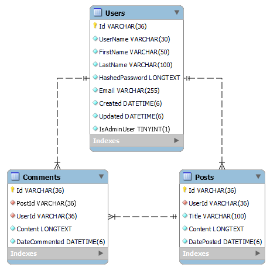

# Prosjektbeskrivelse: Studentblogg

## Formål

Lage en enkel bloggplatform der brukere kan registrere seg, logge inn, skrive innlegg (posts) og legge igjen kommentarer til innlegg. Dette skal være et Controller-based API.

## Sikkerhet

### **Autentisering**

- Må være registrert bruker for å bruke REST-API og må sende med brukernavn og passord for hver request til REST-Api.
- Kan registrere ny bruker uten å måtte autentisere seg med brukernavn og passord.
- Uautoriserte brukere skal få HTTP status 401 unauthorized.

### **Autorisasjon**

- Bruker kan bare oppdatere, legge inn data og slette på egne poster og kommentarer, og skal få tilbake HTTP status code 401 unauthorized hvis de prøver å endre data som ikke tilhører dem.

## Komponenter
🔗

### **Endepunkter**

#### **Users Controller**

| **Metode** | **Endepunkt**                         | **Beskrivelse**                                                                 | **Autentisering** | **Autorisasjon** |
|------------|----------------------------------------|---------------------------------------------------------------------------------|-------------------|------------------|
| POST       | `/api/v1/users/register`               | Registrer en ny bruker                                                          | Nei               | Nei              |
| GET        | `/api/v1/users?page=1&size=10`         | Henter informasjon om alle brukere (paginering)                                 | Ja                | Nei              |
| GET        | `/api/v1/users/{id}`                   | Henter informasjon om en spesifikk bruker                                       | Ja                | Nei              |
| GET        | `/api/v1/users/{id}/posts`         | Henter alle poster for denne brukeren  (ikke et krav men ta det gjerne med)                                         | Nei               | Nei
| DELETE     | `/api/v1/users/{id}`                   | Sletter en spesifikk bruker, krever autorisasjon                                | Ja                | Ja               |
| UPDATE     | `/api/v1/users/{id}`                   | Oppdaterer en spesifikk bruker, krever autorisasjon                             | Ja                | Ja               |

#### Posts Controller

| **Metode** | **Endepunkt**                         | **Beskrivelse**                                                                 | **Autentisering** | **Autorisasjon** |
|------------|----------------------------------------|---------------------------------------------------------------------------------|-------------------|------------------|
| GET        | `/api/v1/posts?page=1&size=10`         | Hent alle innlegg (paginering)                                                  | Ja                | Nei              |
| GET        | `/api/v1/posts/{postId}`               | Hent et spesifikt innlegg                                                       | Ja                | Nei              |
| POST       | `/api/v1/posts`                        | Legg til et nytt innlegg                                                        | Ja                | Nei              |
| PUT        | `/api/v1/posts/{postId}`               | Oppdater et spesifikt innlegg, kun egne innlegg                                 | Ja                | Ja               |
| DELETE     | `/api/v1/posts/{postId}`               | Slett et spesifikt innlegg, kun egne innlegg                                    | Ja                | Ja               |

#### Comments Controller

| **Metode** | **Endepunkt**                         | **Beskrivelse**                                                                 | **Autentisering** | **Autorisasjon** |
|------------|----------------------------------------|---------------------------------------------------------------------------------|-------------------|------------------|
| GET        | `/api/v1/comments?page=1&size=10`      | Hent alle kommentarer (paginering)                                              | Ja                | Nei              |
| GET        | `/api/v1/comments/{postId}/comments`   | Hent alle kommentarer for et spesifikt innlegg                                  | Nei               | Nei              |
| POST       | `/api/v1/comments/{postId}`            | Legg til en kommentar på et spesifikt innlegg                                   | Ja                | Nei              |
| PUT        | `/api/v1/comments/{commentId}`         | Oppdater en spesifikk kommentar, kun egne kommentarer                           | Ja                | Ja               |
| DELETE     | `/api/v1/comments/{commentId}`         | Slett en spesifikk kommentar, kun egne kommentarer                              | Ja                | Ja               |

### **Middleware**

- **Exception Handling**: Logger viktige hendelser, feil og systeminformasjon.

### **Service Layer**

- Håndterer forretningslogikk.
- Utfører autorisering basert på forretningsregler (f.eks. en bruker kan kun redigere/slette sine egne innlegg).
- Kaller Repository Layer for databasetilgang.

### **Repository Layer**

- Direkte interaksjon med MySQL databasen - Entity Framework.
- CRUD-operasjoner for 'User', 'Posts', og 'Comments'.

## Funksjonalitet

### **1. Bruker**

- Registrering med brukernavn og passord (hashing med salt ved hjelp av BCrypt eller tilsvarende).

### **2. Innlegg (Posts)**

- Brukere kan skrive nye innlegg.
- Brukere kan redigere og slette sine egne innlegg.
- Alle registrerte brukere kan se alle innlegg.

### **3. Kommentarer**

- Autentiserte brukere kan kommentere på innlegg.
- Kommentarforfattere kan redigere og slette sine egne kommentarer.
- Alle kan se kommentarer knyttet til et innlegg.

## Tekniske spesifikasjoner

1. **Autentisering**: Implementert som middleware ved hjelp av enten
   [ ] Basic Authentication
   [ ] API Key
   [ ] JWT
2. **Database**:
   [ ] MySQL med tabellene 'User', 'Posts', og 'Comments'.
   [ ] Bruk av Entity Framework.
3. **Logging**: Bruk av en logging-løsning som Serilog eller innebygd logging i ASP.NET Core for å logge hendelser i systemet.

---
